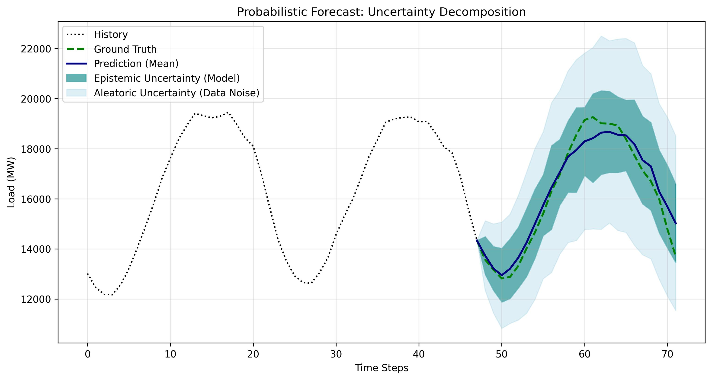
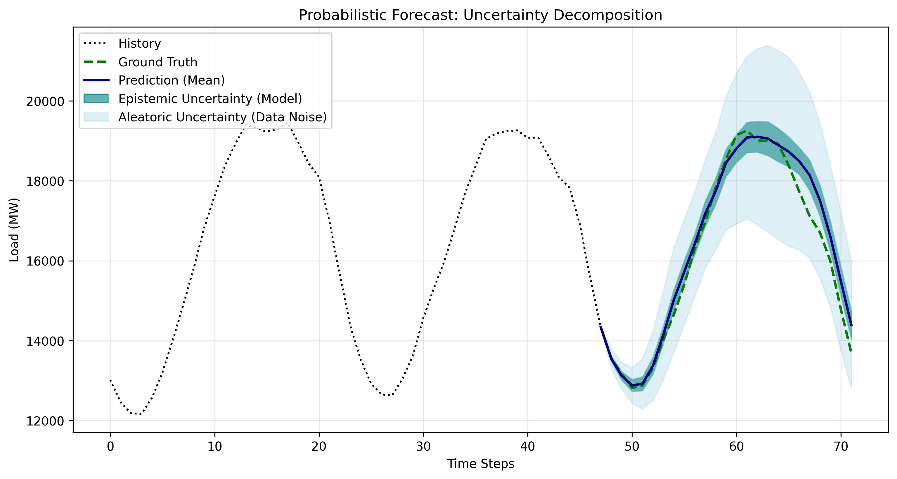

# Probabilistic Energy Load Forecasting via Bayesian LSTM


## Executive Summary & Business Value

In high-stakes sectors like energy trading and grid management, **point estimates are insufficient**. Knowing *that* the load will be 15,000 MW is less valuable than knowing it will be between 14,800 and 15,200 MW with 95% confidence.

This project implements a **Bayesian Long Short-Term Memory (LSTM)** network to predict energy consumption. Unlike standard deep learning models, this solution leverages **Variational Inference** to decompose uncertainty into two actionable components:
1.  **Epistemic Uncertainty:** Uncertainty derived from the model itself (lack of training data).
2.  **Aleatoric Uncertainty:** Noise inherent in the data generation process.

**Use Case:** This approach allows decision-makers to distinguish between "we need more data" (epistemic) and "the system is naturally volatile" (aleatoric), enabling better risk management and resource allocation.

---

## Results & Optimization

The model was evaluated in a cloud environment (Google Colab) to test scalability. By significantly increasing the **batch size** and **training epochs**, we achieved a substantial improvement in prediction accuracy while maintaining robust uncertainty estimation.

### Metric Comparison: Baseline vs. Optimized

| Metric | Baseline (MVP) | Optimized (Final) | Improvement |
| :--- | :--- | :--- | :--- |
| **Configuration** | Batch Size 32, 20 Epochs | **Batch Size 1024, 200 Epochs** | High-Throughput |
| **RMSE** (Root Mean Squared Error) | 563.29 MW | **420.68 MW** | **▼ 25.3% Error Reduction** |
| **MAE** (Mean Absolute Error) | 467.28 MW | **299.88 MW** | **▼ 35.8% Error Reduction** |
| **95% Coverage** | 100.0% | **100.0%** | Robust / Risk-Averse |

### Visual Comparison

**1. Baseline Run (Underfitting)**
*Initial prototype showing wider uncertainty bounds and less precise mean tracking.*


**2. Optimized Run (High Precision)**
*Final model after scaling batch size and training duration. Note the tighter fit to the ground truth (green line) while maintaining a safe uncertainty buffer.*


> **Note on Coverage:** The model currently exhibits 100% coverage of the 95% confidence interval. In the context of critical infrastructure, this "conservative" calibration is often preferred to avoid false negatives (underestimating peak loads), ensuring grid stability.

---

## Technical Methodology

The core architecture combines the sequence modeling capabilities of LSTMs with the probabilistic framework of **Pyro (built on PyTorch)**.

### Key Components:
* **Bayesian Layers:** Weights and biases are not fixed values but probability distributions (Gaussian priors).
* **Variational Inference (SVI):** We approximate the complex posterior distribution using a diagonal normal guide and optimize the Evidence Lower Bound (ELBO).
* **Modular Design:** The project utilizes distinct modules for data loading, model definition, and configuration management using Python `dataclasses`.

### Tech Stack:
* **Deep Learning:** PyTorch, Pyro (Probabilistic Programming)
* **Data Handling:** Pandas, NumPy, Scikit-Learn
* **Visualization:** Matplotlib
* **Environment:** Managed via `uv` (modern Python package manager)

---

## How to Run

This project uses `uv` for fast and reliable dependency management.

### 1. Clone & Setup
```bash
git clone https://github.com/m0r1tzwa/probabilistic-forecaster.git
cd probabilistic-forecaster

# Install dependencies from lock file
uv sync
```

### 2. Train the Model
To train the Bayesian LSTM with Variational Inference:
```bash
uv run main.py --mode train --look_back 48 --horizon 24
```

### 3. Evaluate & Visualize
To generate the uncertainty decomposition plots:
```bash
uv run main.py --mode eval
```

---

## Project Structure

```text
probabilistic-forecaster/
├── data/
│   └── AEP_hourly.csv      # Time-series data(Download source below)
├── src/
│   ├── config.py           # Configuration via Dataclasses
│   ├── data_loader.py      # Preprocessing & Windowing logic
│   ├── model.py            # Bayesian LSTM (Pyro Module)
│   └── visualize.py        # Plotting logic for uncertainty
├── images/                 # Generated plots
├── main.py                 # Entry point for training/eval
├── pyproject.toml          # Project dependencies
└── uv.lock                 # Exact dependency tree
```

### Data Setup
Note: The dataset is excluded from the repository for efficiency.
1. Download the `AEP_hourly.csv` file from [Kaggle (PJM Hourly Energy Consumption Data)](https://www.kaggle.com/datasets/robikscube/hourly-energy-consumption).
2. Place the file in the `data/` directory.

## Contact

**Moritz Wagenknecht** [\[LinkedIn\]](https://www.linkedin.com/in/moritz-wagenknecht-5174812ab/)